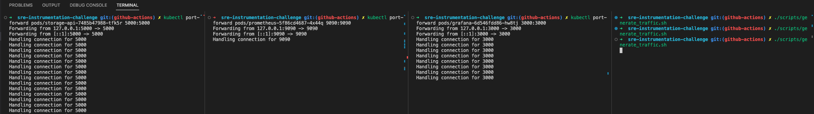

# SRE Instrumentation Challenge - Roberto Gutiérrez solution and step-by-step process

### How to test this solution:
1. Apply all the manifests inside kubernetes/manifest into a cluster `kubectl apply -f kubernetes-manifests` + `kubectl port-forward pods/grafana-pod-name 3000:3000;kubectl port-forward pods/storage-api-pod-name 5000:5000;kubectl port-forward pods/prometheus-pod-name 9090:9090` OR docker-compose up
2. Go to localhost:3000 (admin/admin)
3. Import grafana-dashboard.json
4. Execute ./scripts/generate_traffic.sh
5. Check dashboards

### Step 0: Understand what's happening

- Have a quick look at the code itself - particularly at Readmes, Makefile, bucket.py and _more or less_ understand the objective
- Prepare some tools: python3, pip3, docker... And install dependencies 
- Run the code with make run and do a couple of requests of each method
- Once everything makes a bit of sense, start with step 1

### Step 1: Implementation

- For adding the Prometheus-related stuff I looked for a couple of useful links, like the [official docs](https://github.com/prometheus/client_python), a couple of medium articles such as [this](https://medium.com/@letathenasleep/exposing-python-metrics-with-prometheus-c5c837c21e4d) or a more detailed [one](https://medium.com/swlh/generate-and-track-metrics-for-flask-api-applications-using-prometheus-and-grafana-55ddd39866f0)
- Decided to add _some_ logging and more responses to the endpoints (In order to be able to play around and test a bit better)
- I kept the Dockerfile simple, using a slim python version.
- Tried the docker file with `docker build -t storage_api . ` + `docker run -d -p 5000:5000 storage_api:latest` + some curls 

### Step 2: Visualization
- For the docker-compose up I had some issues on disk space which were interesting to debug. (Naturally I have _more_ than enough disk space, but it seems I had many unused docker volumes, which took me a while to debug)
- I had an issue with the /metrics endpoint, it was in /api/metrics, so I had to update prometheus/prometheys.yml (Took a bit to find that one)
- I explored prometheus stats and played around with the Grafana dashboards, but I decided to move quickly to the last step as I've got 1-2h left and I feel Grafana dashboards can absorb a lot of time and my knowledge is a bit rusted. 

### Step 3: Deployment
- I'd normally go for helm or kustomize for a deployment, but I decided to keep it as simple and straightforward as possible
- Not using any namespace for simplicity reasons
- I didn't spend any time with ingresses, loadbalancers, etc... Directly using services. 
- Created a really basic github-actions workflow to test, build and deploy images
- Tested the yaml files agains a personal playground GKE cluster (in GCP) + kubectl port-forward

### What can be improved with more time
1. Grafana dashboards are quite terrible
2. More and better logging
3. More and better unitary testing with pytest
4. Github actions workflow is quite simple - I'd add merged-pr.yml, deploy.yml, concurrency-matrix for properly testing... 
5. Loadbalancers, ingress-controllers, cert-managers... 

